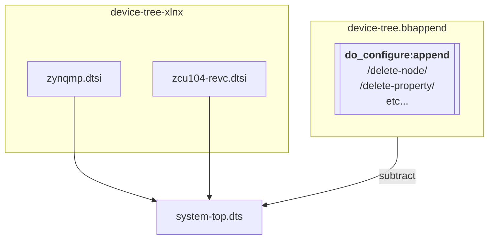
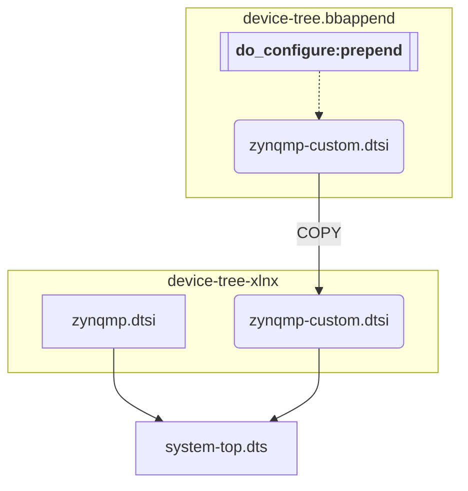

See [tasks.json](.vscode/tasks.json) for commands.

These examples use templates to load configuration settings from a BSP. They demonstrate two approaches to using the Xilinx device tree generator (DTG) to import hardware settings from a Vivado project (.xsa)

## [custom.conf](layers/meta-test/conf/machine/custom.conf):

Using [zynqmp.dtsi](https://github.com/Xilinx/device-tree-xlnx/blob/xlnx_rel_v2022.2/device_tree/data/kernel_dtsi/2022.2/zynqmp/zynqmp.dtsi) as a base devicetree and selecting [zcu104-revc.dtsi](https://github.com/Xilinx/device-tree-xlnx/blob/xlnx_rel_v2022.2/device_tree/data/kernel_dtsi/2022.2/BOARD/zcu104-revc.dtsi) with DTG. Unwanted nodes can then subtracted using device tree overlays. 

## [custom_dts.conf](layers/meta-test/conf/machine/custom_dts.conf):

Using [zynqmp.dtsi](https://github.com/Xilinx/device-tree-xlnx/blob/xlnx_rel_v2022.2/device_tree/data/kernel_dtsi/2022.2/zynqmp/zynqmp.dtsi) as a base devicetree and patching DTG with our own custom dtsi. This doesn't include any unwanted nodes from the zcu104 device tree and therefore, requires less subtraction via overlays.

Note: Because `zynqmp-custom.dtsi` is included at the top of `system-top.dts`, any setting made in `zynqmp-custom.dtsi` can be overwritten by `system-top.dts`. Changes to `system-top.dts` settings should be done using `echo` in the `device-tree.bbappend` file. 

## DTG

- [device_tree.tcl](https://github.com/Xilinx/device-tree-xlnx/blob/xlnx_rel_v2022.2/device_tree/data/device_tree.tcl)
- [dtgen.tcl](layers/meta-xilinx-tools/scripts/dtgen.tcl)